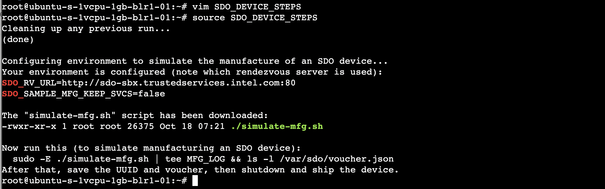
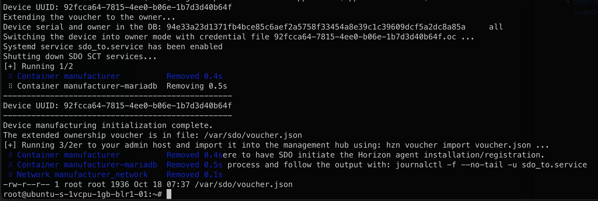
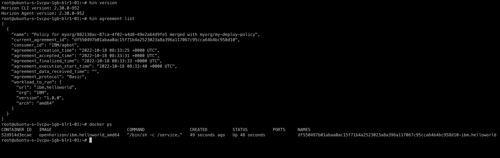

# Secure Device Onboarding (SDO) with Open Horizon

This is a guide to onboard a secure device onto open horizon and run Hello World Docker Job on the device.

## Prerequisites
- **`edge-node`**: A Linux device that you would like to setup as an *SDO device*.
- **`oh-server`**: Up and running *Management Hub* server with properly configured credentials like `HZN_ORG_ID`, `HZN_EXCHANGE_USER_AUTH`, etc.


## SDO Use-Case
We will be onborading a linux device as edge-node onto management hub using some voucher and then open horizon will automatically intall the agent and run the specified job (like [ibm/hello-world](https://hub.docker.com/_/hello-world)).

## Secure Device Onboarding Steps


- Login to *edge-node* and download file [SDO_DEVICE_STEPS](./SDO_DEVICE_STEPS) or create a new file with same content.
- Execute the file on *edge-node* as follows:
  ```bash
  source SDO_DEVICE_STEPS
  ```
  

- Now on *oh-server*, make sure to export the variable `HZN_SDO_SVC_URL` and `SDO_SAMPLE_MFG_KEEP_SVCS`
  ```bash
  export SDO_RV_URL=http://sdo-sbx.trustedservices.intel.com:80
  export SDO_SAMPLE_MFG_KEEP_SVCS=false 
  ```

- On *edge-node* after  successfull execution of `SDO_DEVICE_STEPS`, you will be asked to run a command involving `simulate-mfg.sh` file. Copy that command and run it. 
  ```bash
  sudo -E ./simulate-mfg.sh | tee MFG_LOG && ls -l /var/sdo/voucher.json
  ```
  It will take just a few minutes to run (to simulate the process of manufacturing this machine as an SDO device)..

  

  This will generate a `voucher.json`, and also please note down the device uuid from logs.

- On *oh-server*, copy the `voucher.json` from *edge-node*, you can either `scp` or copy the content, your choice. <br>
  Also create the `node.policy.json` ([example](./node.policy.json)), and run following command.
  ```bash
  hzn voucher import voucher.json --policy node.policy.json
  ```
- The node will be added with the device id of you edge node, to verify run this on *oh-server*
  ```bash
  hzn exchange node list
  ```
- Now, on *oh-server* create the deployment policy with example file [deployment.policy.json](./deployment.policy.json) as follows
  ```bash
  hzn exchange deployment addpolicy --json-file deployment.policy.json my-deploy-policy
  hzn exchange deployment listpolicy # verify
  ```
  
- Finally, restart the *edge-node*, open-horizon will intall the agent on the SDO device and sign the agreement to run the job matching node and deployment policies.
  
  


<br>
<br>

## References
- https://github.com/TheMosquito/easy-sdo-oh#easy-sdo-oh
- https://www.youtube.com/watch?v=dNGv2xVVAvs&list=PLgohd895XSUddtseFy4HxCqTqqlYfW8Ix&index=13